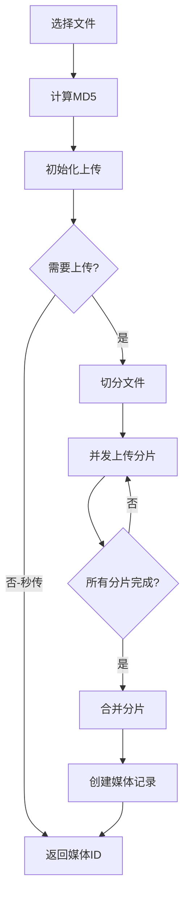

# 文件上传系统 - 完整实现文档

## 🚀 功能特性

### 核心功能
- ✅ **批量上传** - 支持同时上传多个文件
- ✅ **大文件切片** - 自动将大文件切分成小块上传（默认5MB/片）
- ✅ **断点续传** - 上传中断后可从断点继续上传
- ✅ **秒传功能** - 相同文件直接返回已有结果
- ✅ **并发控制** - 控制同时上传的分片数量（默认3个）
- ✅ **进度监控** - 实时显示上传进度
- ✅ **失败重试** - 自动重试失败的分片
- ✅ **取消上传** - 支持取消正在进行的上传
- ✅ **拖拽上传** - 支持拖拽文件到上传区域

### 技术特点
- 使用MD5计算文件指纹，实现秒传和去重
- 分片上传减少内存占用，支持超大文件
- 断点续传提高上传成功率
- 并发上传提高传输效率

## 📁 项目结构

### 后端 (NestJS)
```
fans-backend/
├── src/upload/                    # 上传模块
│   ├── upload.module.ts          # 模块配置
│   ├── upload.controller.ts      # 控制器（API接口）
│   ├── upload.service.ts         # 服务层（业务逻辑）
│   └── dto/
│       └── upload.dto.ts         # 数据传输对象
├── prisma/
│   └── schema.prisma             # 数据库模型（含Upload表）
└── uploads/                      # 上传文件存储目录
    ├── temp/                     # 临时文件
    ├── chunks/                   # 分片文件
    ├── image/                    # 图片文件
    └── video/                    # 视频文件
```

### 前端 (Next.js)
```
fans-next/
├── src/lib/upload/
│   └── file-uploader.ts          # 文件上传器核心类
├── src/components/upload/
│   └── AdvancedUploadModal.tsx   # 高级上传组件
└── src/app/test-upload/
    └── page.tsx                  # 测试页面
```

## 🔧 技术实现

### 1. 数据库设计

```prisma
model Upload {
  id              String       @id @default(uuid())
  filename        String       # 原始文件名
  file_size       BigInt       # 文件大小
  file_type       String       # 文件类型
  file_md5        String       # 文件MD5值
  chunk_size      Int          # 分片大小
  total_chunks    Int          # 总分片数
  uploaded_chunks Json         # 已上传分片
  status          UploadStatus # 上传状态
  temp_path       String?      # 临时路径
  final_path      String?      # 最终路径
  error_message   String?      # 错误信息
  metadata        Json?        # 元数据
  expires_at      DateTime?    # 过期时间
  
  user_id         Int
  user            User         @relation(...)
  media_id        String?      @unique
  media           Media?       @relation(...)
}

enum UploadStatus {
  PENDING    # 待上传
  UPLOADING  # 上传中
  MERGING    # 合并中
  COMPLETED  # 已完成
  FAILED     # 失败
  EXPIRED    # 已过期
}
```

### 2. API接口

#### 初始化上传
```
POST /api/upload/init
Authorization: Bearer {token}

{
  "filename": "video.mp4",
  "fileSize": 104857600,
  "fileType": "video",
  "fileMd5": "abc123...",
  "chunkSize": 5242880,
  "title": "视频标题",
  "description": "描述",
  "tagIds": ["tag1", "tag2"],
  "categoryId": "cat1"
}

Response:
{
  "uploadId": "upload-123",
  "needUpload": true,
  "uploadedChunks": [0, 1, 2],  // 已上传的分片
  "mediaId": null
}
```

#### 上传分片
```
POST /api/upload/chunk
Authorization: Bearer {token}
Content-Type: multipart/form-data

FormData:
- chunk: (binary)
- uploadId: "upload-123"
- chunkIndex: 3
- totalChunks: 20

Response:
{
  "success": true,
  "message": "分片 3 上传成功"
}
```

#### 合并分片
```
POST /api/upload/merge
Authorization: Bearer {token}

{
  "uploadId": "upload-123",
  "fileMd5": "abc123..."
}

Response:
{
  "mediaId": "media-456"
}
```

#### 获取上传进度
```
GET /api/upload/progress/{uploadId}
Authorization: Bearer {token}

Response:
{
  "uploadId": "upload-123",
  "uploadedChunks": [0, 1, 2, 3],
  "progress": 20,
  "status": "uploading"
}
```

#### 取消上传
```
DELETE /api/upload/{uploadId}
Authorization: Bearer {token}

Response: 204 No Content
```

### 3. 上传流程



### 4. 前端实现要点

#### FileUploader类
- 管理所有上传任务
- 计算文件MD5
- 控制并发上传
- 处理断点续传
- 提供进度回调

#### AdvancedUploadModal组件
- 拖拽上传界面
- 批量文件管理
- 元数据编辑
- 进度显示
- 错误处理

## 🎯 使用指南

### 1. 启动服务

```bash
# 后端
cd fans-backend
npm run start:dev

# 前端
cd fans-next
npm run dev
```

### 2. 访问测试页面

打开浏览器访问: http://localhost:3001/test-upload

### 3. 测试功能

1. **批量上传**: 选择多个文件或拖拽文件到上传区域
2. **大文件测试**: 上传超过5MB的文件查看分片效果
3. **断点续传**: 上传过程中刷新页面，再次上传相同文件
4. **秒传测试**: 上传已存在的文件
5. **取消上传**: 点击取消按钮停止上传

## 🔍 调试技巧

### 查看上传日志
```bash
# 后端日志
tail -f fans-backend/logs/app.log

# 浏览器控制台
# 查看上传进度和错误信息
```

### 检查上传文件
```bash
# 查看分片文件
ls -la fans-backend/uploads/chunks/

# 查看最终文件
ls -la fans-backend/uploads/image/
ls -la fans-backend/uploads/video/
```

### 数据库查询
```sql
-- 查看上传记录
SELECT * FROM "Upload" ORDER BY created_at DESC;

-- 查看未完成的上传
SELECT * FROM "Upload" WHERE status IN ('PENDING', 'UPLOADING');
```

## ⚙️ 配置选项

### 后端配置
```typescript
// 上传目录
UPLOAD_DIR=uploads

// 最大文件大小（默认1GB）
UPLOAD_MAX_SIZE=1073741824

// 分片大小（默认5MB）
DEFAULT_CHUNK_SIZE=5242880

// 上传过期时间（默认24小时）
UPLOAD_EXPIRE_HOURS=24
```

### 前端配置
```typescript
// file-uploader.ts
const defaultChunkSize = 5 * 1024 * 1024; // 5MB
const maxConcurrent = 3; // 最大并发数
```

## 🚨 注意事项

1. **文件大小限制**: 
   - Nginx默认限制1MB，需要配置 `client_max_body_size`
   - Node.js需要配置请求体大小限制

2. **存储空间**: 
   - 分片文件会占用额外空间
   - 定期清理过期的上传记录

3. **并发控制**: 
   - 过多并发可能导致服务器压力
   - 建议根据服务器性能调整

4. **安全考虑**: 
   - 验证文件类型和大小
   - 使用JWT认证保护接口
   - 定期清理临时文件

## 📊 性能优化

1. **使用CDN**: 将上传的文件存储到CDN
2. **异步处理**: 大文件合并使用队列异步处理
3. **缓存优化**: 缓存MD5计算结果
4. **数据库索引**: 为file_md5字段添加索引

## 🔄 后续改进

1. **云存储支持**: 集成阿里云OSS、AWS S3等
2. **视频处理**: 自动转码、生成缩略图
3. **图片处理**: 自动压缩、生成不同尺寸
4. **权限控制**: 更细粒度的上传权限
5. **统计分析**: 上传统计、用户行为分析

## 📝 总结

本上传系统实现了一个完整的、生产级的文件上传解决方案，包含了所有现代上传系统应有的特性。通过切片上传、断点续传、秒传等技术，大大提升了用户体验和上传成功率。系统设计灵活，易于扩展，可以根据实际需求进行定制和优化。 